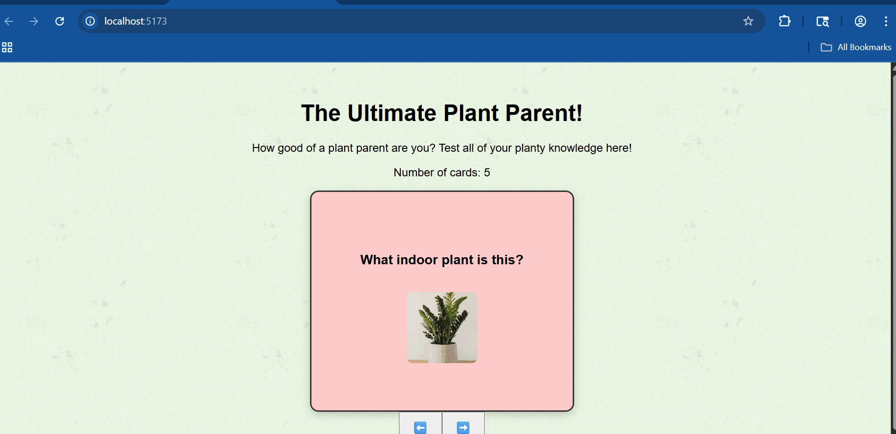

# Flashcards Part 2 - The Ultimate Plant Parent!

Submitted by: **Karthik Deevenapalli**

This web app: **is a plant-themed flashcard app that helps users test their knowledge of houseplants by flipping cards containing questions and answers, including images and difficulty categories. It includes features like guessing, feedback, streak tracking, shuffling, and mastered card removal.**

Time spent: **10 hours** spent in total

---

## ✅ Required Features

The following **required** functionality is completed:

- [x] The app displays the title of the card set, a short description, and the total number of cards
  - [x] Title of card set is displayed
  - [x] A short description of the card set is displayed
  - [x] A list of card pairs is created
  - [x] The total number of cards in the set is displayed
  - [x] Card set is represented as an array of question/answer objects
- [x] A single card at a time is displayed
  - [x] Only one half of the card pair is shown at a time
- [x] Clicking on the card flips it to show the other side
  - [x] Clicking again flips it back
- [x] The user can enter their guess before seeing the answer
  - [x] A clearly labeled input and submit button is shown
  - [x] Clicking submit gives visual feedback on correctness
- [x] The user can navigate through the card set using forward/back buttons
  - [x] Back/Next buttons update the current card in sequence
  - [x] Buttons are disabled at the beginning/end of the list (no wrap-around)

---

## 🌟 Optional + Stretch Features

- [x] Cards contain images in addition to or in place of text
- [x] Cards are styled by difficulty (Easy / Medium / Hard)
- [x] Cards only shuffle when Shuffle button is clicked
- [x] Answer input uses fuzzy matching (ignores case, punctuation, allows partial match)
- [x] Tracks current and longest correct answer streaks
- [x] Users can mark a card as "mastered"
  - [x] Mastered cards are removed from the deck and tracked separately

---

## 🔁 Additional Features Implemented

- [x] Smooth flip animations using CSS
- [x] Local image loading using asset imports
- [x] Responsive layout for desktop and mobile
- [x] Vite + React project setup for fast dev experience

---

## 📹 Video Walkthrough

Here's a walkthrough of implemented features:

GIF created with **ScreenToGif**

---

## 🛠 Notes

Challenges encountered during development:

- File name conflicts and image paths caused initial loading issues
- CSS animation tuning was required to make the flip feel natural
- Avoiding infinite navigation (no wrap-around) required index-bound logic
- Matching user answers flexibly while avoiding false positives took string sanitization

---

## 📄 License

